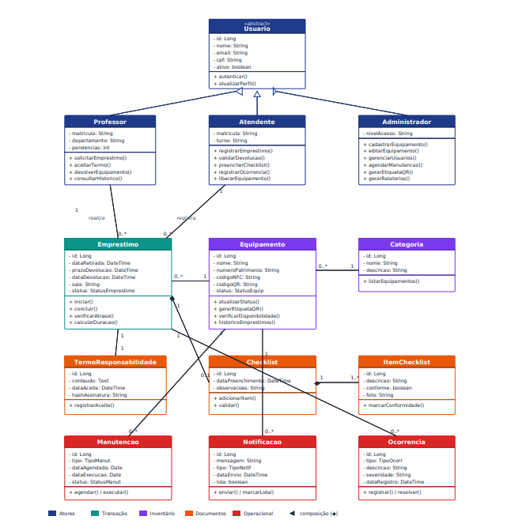
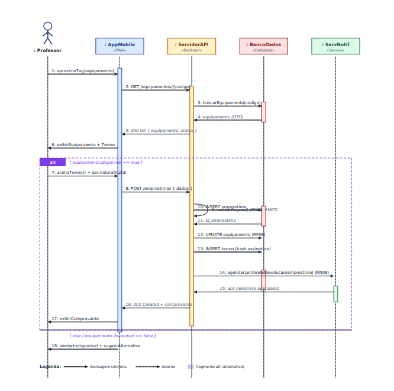

# PROJETO GAC - Gestão de Ativos do CCT
**Documento de Requisitos e Modelagem Inicial**
*Milestone M1 – Sprints 1, 2 e 3*

---

## 1. Documento de Visão

### 1.1 Introdução
Este documento apresenta a visão consolidada do sistema GAC (Gestão de Ativos do CCT), proposto como projeto de extensão para o Centro de Ciências Tecnológicas (CCT) da Universidade de Fortaleza (Unifor). O sistema tem como propósito digitalizar o ciclo de vida dos ativos patrimoniais do centro – em especial projetores e chaves – substituindo controles manuais e informais por uma plataforma integrada a identificadores físicos por NFC e/ou QR Code.

### 1.2 Posicionamento
| Aspecto | Descrição |
|---------|-----------|
| **Domínio** | Gestão patrimonial e operacional em ambiente acadêmico |
| **Escopo** | Ciclo de vida de ativos: cadastro → empréstimo → devolução → manutenção → relatórios |
| **Público-alvo** | Professores, atendentes, coordenação e direção do CCT |
| **Plataformas** | Aplicativo mobile (retirada/devolução ágil) + interface web (gestão e relatórios) |
| **Tecnologias-chave** | NFC, QR Code, banco de dados relacional, arquitetura cliente-servidor |

### 1.3 Descrição do Problema
**Problema atual:** O controle de empréstimos de equipamentos no CCT envolve registros manuais, comunicação informal e conferência operacional pouco padronizada.
**Consequências observadas:**
- Perda de rastreabilidade dos ativos patrimoniais.
- Risco de extravio, dano ou troca de equipamentos sem responsável claramente identificado.
- Tempo elevado de retirada e devolução, prejudicando o início pontual das aulas.
- Falta de histórico consolidado para auditoria, planejamento de compras e manutenção.
- Dificuldade de comunicação entre atendentes, coordenação e professores sobre prazos e atrasos.

---

## 2. Identificação de Stakeholders

### 2.1 Stakeholders Primários
| Stakeholder | Papel | Interesses / Necessidades |
|-------------|-------|---------------------------|
| **Professor do CCT** | Usuário final que retira e devolve equipamentos. | Retirada rápida; lembretes de prazos; saber o que está disponível. |
| **Atendente do CCT** | Funcionário do balcão que autoriza e valida devoluções. | Reduzir filas, ter histórico imediato, registrar avarias. |
| **Administrador** | Responsável pelo cadastro e sistema. | Cadastrar inventário, gerar etiquetas NFC/QR, gerir usuários. |

---

## 3. Requisitos do Sistema

### 3.1 Requisitos Funcionais (RF)
| Cód. | Requisito | Descrição | Prioridade |
|------|-----------|-------------|------------|
| **RF01** | Autenticar usuário | Login via SSO da Unifor com diferenciação de perfis. | Alta |
| **RF02** | Cadastrar equipamento | O admin deve poder cadastrar equipamentos com NFC/QR. | Alta |
| **RF04** | Consultar disponibilidade | Exibir lista de equipamentos e seus status em tempo real. | Alta |
| **RF05** | Identificar por NFC/QR | App mobile deve ler etiqueta para retornar dados. | Alta |
| **RF06** | Realizar empréstimo | Registrar data, sala, prazo e responsável pelo ativo. | Alta |
| **RF07** | Aceite digital de termo | Exigir assinatura digital do termo na retirada. | Alta |
| **RF08** | Devolução com checklist | Checklist técnico personalizado e registro de avarias/fotos. | Alta |
| **RF10** | Notificar prazo | Enviar notificação X minutos antes do prazo acabar. | Alta |

### 3.2 Requisitos Não Funcionais (RNF)
| Cód. | Categoria | Descrição | Prioridade |
|------|-----------|-------------|------------|
| **RNF01** | Desempenho | Tempo de resposta de telas principais < 2 segundos. | Alta |
| **RNF03** | Disponibilidade | Sistema disponível 99% do horário do CCT (07h-22h). | Alta |
| **RNF04** | Segurança | Comunicação via HTTPS com TLS 1.2 ou superior. | Alta |
| **RNF06** | Conformidade | Atender à LGPD (minimização, exclusão de dados). | Alta |

---

## 4. Regras de Negócio
| Cód. | Regra | Descrição |
|------|-------|-------------|
| **RN01** | Empréstimo autorizado | Somente professores e atendentes ativos podem registrar empréstimos. |
| **RN02** | Equipamento único | Um equipamento não pode ter mais de um empréstimo ativo. |
| **RN04** | Prazo padrão | Término da aula prevista, limitado a 4 horas. |
| **RN05** | Aceite obrigatório | Nenhum empréstimo é efetivado sem o aceite do termo. |

---

## 5. Backlog Priorizado (MoSCoW)

### MUST HAVE (Essencial para o MVP - Sprints 1, 2 e 3)
* **US01:** Como professor, quero autenticar com meu login Unifor. (RF01 - S1)
* **US02:** Como administrador, quero cadastrar um equipamento com NFC/QR. (RF02 - S1)
* **US03:** Como professor, quero consultar a lista de equipamentos disponíveis. (RF04 - S1)
* **US04:** Como professor, quero identificar um equipamento por NFC/QR. (RF05 - S2)
* **US05:** Como professor, quero aceitar digitalmente o termo de responsabilidade. (RF07 - S2)
* **US06:** Como atendente, quero registrar o empréstimo com data, sala e prazo. (RF06, RF09 - S2)
* **US07:** Como atendente, quero conferir a devolução com checklist. (RF08, RF09 - S3)
* **US08:** Como professor, quero receber notificação do prazo. (RF10 - S3)

---

## 6. Diagramas UML

- **Diagrama de Casos de Uso:**

- **Diagrama de Classes:**

- **Diagrama de Sequência:**

