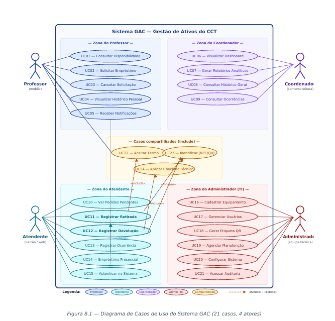

# PROJETO GAC - Gestão de Ativos do CCT
**Documento de Requisitos e Modelagem Inicial**
*Milestone M1 – Sprints 1, 2 e 3*

---

## 1. Documento de Visão

### 1.1 Introdução
Este documento apresenta a visão consolidada do sistema GAC (Gestão de Ativos do CCT), proposto como projeto de extensão para o Centro de Ciências Tecnológicas (CCT) da Universidade de Fortaleza (Unifor). O sistema tem como propósito digitalizar o ciclo de vida dos ativos patrimoniais do centro – em especial projetores e chaves – substituindo controles manuais e informais por uma plataforma integrada a identificadores físicos por NFC e/ou QR Code.

### 1.2 Posicionamento
| Aspecto | Descrição |
|---------|-----------|
| **Domínio** | Gestão patrimonial e operacional em ambiente acadêmico |
| **Escopo** | Ciclo de vida de ativos: cadastro → empréstimo → devolução → manutenção → relatórios |
| **Público-alvo** | Professores, atendentes, coordenação e direção do CCT |
| **Plataformas** | Aplicativo mobile (retirada/devolução ágil) + interface web (gestão e relatórios) |
| **Tecnologias-chave** | NFC, QR Code, banco de dados relacional, arquitetura cliente-servidor |

### 1.3 Descrição do Problema

**Problema atual:** O controle de empréstimos de equipamentos no CCT envolve registros manuais, comunicação informal e conferência operacional pouco padronizada, o que dificulta identificar quem está com determinado item, quando ele foi retirado, quando deveria ser devolvido e em que estado foi entregue.

#### Consequências observadas

- Perda de rastreabilidade dos ativos patrimoniais (projetores, chaves, acessórios).
- Risco de extravio, dano ou troca de equipamentos sem responsável claramente identificado.
- Tempo elevado de retirada e devolução, prejudicando o início pontual das aulas.
- Falta de histórico consolidado para auditoria, planejamento de compras e manutenção.
- Dificuldade de comunicação entre atendentes, coordenação e professores sobre prazos e atrasos.

### 1.4 Declaração da Posição do Produto

| Aspecto | Descrição |
|----------|-----------|
| **Para** | Professores, atendentes, coordenação e equipe técnica do CCT |
| **Que** | Precisam controlar a retirada, devolução e manutenção de projetores, chaves e demais ativos do centro |
| **O** | GAC – Sistema de Gestão de Ativos do CCT |
| **É um** | Sistema digital integrado a identificadores físicos (NFC/QR Code) com aplicações mobile e web |
| **Que** | Oferece rastreabilidade em tempo real, aceite digital de termos de responsabilidade, checklist técnico de devolução, alertas automáticos e relatórios analíticos |
| **Diferentemente de** | Controles manuais em planilhas e cadernos físicos, ou de soluções genéricas de inventário não adaptadas ao contexto acadêmico |
| **O nosso produto** | É projetado especificamente para o fluxo do CCT, prioriza agilidade no balcão e fornece auditoria completa do ciclo de vida do ativo |

### 1.5 Visão Geral do Produto

O GAC é composto por dois grandes módulos que atendem perfis de uso distintos:

| Interface | Funções principais | Usuário-alvo |
|------------|-------------------|-------------|
| **Mobile (uso rápido)** | Consulta de disponibilidade, solicitação de empréstimo, aceite de termo, recebimento de notificações, consulta ao histórico pessoal | Professores |
| **Web (operacional)** | Atendimento de pedidos pendentes, registro de retirada (baixa) com leitura NFC/QR, registro de devolução com checklist, ocorrências | Atendentes |
| **Web (gestão)** | Dashboard, relatórios analíticos, consulta de históricos — apenas leitura | Coordenação |
| **Web (técnico)** | Cadastro de equipamentos, gestão de usuários, agendamento de manutenções, geração de QR, configuração | Equipe técnica / Administrador |

#### Principais recursos (features)

1. **Solicitação ágil via mobile** — professor abre o app, escolhe o equipamento e a sala e gera um pedido pendente.
2. **Retirada com baixa no balcão** — atendente lê NFC/QR do equipamento e confirma a retirada vinculada ao pedido.
3. **Devolução com checklist técnico** — atendente confere acessórios e estado físico ao receber o item.
4. **Gestão e auditoria centralizada** — atualização automática de status e trilha imutável de histórico.
5. **Cadastro e manutenção do inventário** — registro de novos itens e agendamento preventivo (área técnica).
6. **Alertas e notificações automáticas** — lembretes de prazo e eventos críticos.
7. **Relatórios analíticos** — visualização gerencial para a coordenação, sem permissão de alteração.

### 1.6 Fluxo Operacional Simplificado

O fluxo central do sistema envolve a interação direta entre **Professor** (mobile) e **Atendente** (web). Os demais perfis atuam fora desse fluxo operacional: a **Coordenação** apenas observa indicadores e gera relatórios, sem alterar o funcionamento; e a equipe técnica (**Administrador**) configura o sistema, cadastra ativos e mantém a infraestrutura.

#### Visão resumida do fluxo

1. O **Professor** abre o app e solicita um equipamento (informa data, horário e sala). O sistema cria um pedido pendente.
2. O **Professor** vai até o balcão do CCT.
3. O **Atendente** visualiza o pedido pendente, lê o NFC/QR do equipamento e dá baixa de retirada no sistema.
4. O **Professor** aceita digitalmente o termo de responsabilidade e leva o equipamento.
5. Após o uso, o **Professor** retorna o equipamento ao balcão.
6. O **Atendente** lê novamente o NFC/QR, preenche o checklist técnico e dá baixa de devolução. O ciclo se encerra com o equipamento retornando ao status "disponível".

### 1.7 Restrições e Premissas

#### Restrições

- Solução deve operar dentro da infraestrutura de rede da Unifor.
- Os equipamentos físicos (projetores, chaves) serão etiquetados com NFC e/ou QR Code.
- O sistema não substitui o controle patrimonial corporativo da universidade — apenas o complementa no nível operacional do CCT.
- A autenticação deve respeitar políticas da TI da Unifor (idealmente integrada ao SSO institucional).
- A coordenação tem acesso somente leitura: **nenhuma ação da coordenação pode alterar o estado operacional do sistema.**

#### Premissas

- Professores possuem smartphone com leitor de QR Code e/ou NFC.
- O CCT manterá ao menos um atendente presencial no balcão durante o horário de funcionamento.
- Existirá conexão de rede estável no ambiente do CCT.
- A equipe técnica do projeto (administradores) será responsável pela manutenção, configuração e acesso à base de dados e variáveis de ambiente.

---

## 2. Identificação de Stakeholders

Os stakeholders foram identificados a partir da análise do escopo do projeto e validados nas entrevistas com a equipe do CCT. Estão classificados em três níveis: **primários** (uso direto da solução), **secundários** (afetados ou que apoiam o uso) e **externos** (fora do CCT, mas com interface com o sistema).

### 2.1 Stakeholders Primários

| Stakeholder | Papel | Interesses / Necessidades |
| :--- | :--- | :--- |
| **Professor do CCT** | Usuário final que solicita, retira (no balcão) e devolve projetores e chaves para uso em sala de aula. | Solicitar empréstimo pelo app; retirada e devolução rápidas no balcão; ter clareza do termo aceito; não esquecer prazos. |
| **Atendente do CCT** | Funcionário do balcão que atende pedidos pendentes, dá baixa de retirada e devolução, preenche checklist e registra ocorrências. | Reduzir filas, ter histórico imediato, registrar avarias com facilidade, ver pedidos pendentes no painel. |
| **Administrador / Equipe Técnica** | Equipe responsável pelo desenvolvimento e operação técnica: configura o sistema, tem acesso ao banco de dados, variáveis de ambiente, cadastros, usuários e infraestrutura. | Cadastrar e atualizar inventário; controlar permissões; gerar etiquetas NFC/QR; agendar manutenções; manter sistema estável. |

### 2.2 Stakeholders Secundários

| Stakeholder | Papel | Interesses / Necessidades |
| :--- | :--- | :--- |
| **Coordenação do CCT** | Acompanha indicadores de uso, atrasos e disponibilidade. **Atua apenas em modo de leitura: não altera o estado operacional do sistema.** | Painel gerencial; relatórios mensais; alertas de incidentes; histórico por professor / curso. |
| **Direção do CCT** | Toma decisões estratégicas sobre compras e renovação de equipamentos com base nos relatórios. | Indicadores agregados; ocorrências de extravio/dano; previsão de demanda. |
| **Equipe de Manutenção** | Atende chamados e executa manutenção preventiva e corretiva. | Receber chamados estruturados; ver histórico do ativo; registrar serviços executados. |

### 2.3 Stakeholders Externos

| Stakeholder | Papel | Interesses / Necessidades |
| :--- | :--- | :--- |
| **TI da Unifor** | Hospeda a solução, fornece autenticação institucional e zela pela segurança da informação. | Conformidade com políticas; integração SSO; LGPD; logs e backups. |
| **Setor de Patrimônio** | Mantém o inventário oficial da universidade. | Sincronização de tombamento; rastreabilidade de movimentações. |
| **Alunos** | Beneficiados indiretos pelo melhor funcionamento das aulas. | Aulas iniciando no horário; equipamentos disponíveis e funcionando. |

### 2.4 Matriz de Influência x Interesse

A matriz abaixo orienta a estratégia de engajamento durante a engenharia de requisitos e a implantação:

| | Baixa Influência | Alta Influência |
| :--- | :--- | :--- |
| **Alto Interesse** | **Manter informados:** Alunos, Equipe de Manutenção | **Gerenciar de perto:** Professores, Atendentes, Equipe Técnica (Admin) |
| **Baixo Interesse** | **Monitorar:** Setor de Patrimônio | **Manter satisfeitos:** Coordenação do CCT, Direção do CCT, TI da Unifor |

---

## 3. Roteiro e Resultados de Entrevistas

### 3.1 Metodologia da Elicitação

A elicitação foi conduzida em três frentes complementares:
* **Entrevistas semiestruturadas** com a coordenação do CCT, atendentes do balcão e amostra de professores.
* **Análise documental** de planilhas e cadernos atualmente utilizados para controle de empréstimos.
* **Observação participante** em horários de pico (início e fim das aulas) para entender os gargalos do fluxo manual.

As entrevistas foram conduzidas com tempo médio de 30 minutos por participante. Os resultados abaixo representam a consolidação das respostas mais frequentes e relevantes para o escopo do sistema.

### 3.2 Roteiro — Coordenação do CCT

**Objetivo:** compreender expectativas estratégicas, indicadores desejados e restrições institucionais.

**Q1. Como o controle de empréstimos é feito atualmente? Que dificuldades vocês enfrentam?**
→ "Hoje usamos uma planilha e um caderno físico. Quando o atendente sai, ninguém sabe o que está emprestado. Já aconteceu de o professor reclamar que ficou sem projetor porque não havia registro claro."

**Q2. Quais informações vocês gostariam de ter sobre cada empréstimo?**
→ "Quem pegou, quando, qual sala, e principalmente se devolveu no estado certo. Hoje a gente só descobre o problema dias depois."

**Q3. Que tipos de relatório seriam úteis para a coordenação?**
→ "Quantidade de empréstimos por curso, equipamentos com mais avarias, professores com atrasos recorrentes. E principalmente: previsão de manutenção."

**Q4. Existem políticas ou regras formais sobre prazos, responsabilidades e penalidades?**
→ "Sim. O empréstimo é por tempo de aula — máximo de 4 horas. Se atrasar, o professor recebe um aviso. Avarias são responsabilidade de quem assinou."

**Q5. Há restrições da TI institucional que devemos considerar?**
→ "O ideal é integrar com o login único da Unifor. Não podemos ter senhas separadas. E precisa cumprir a LGPD."

### 3.3 Roteiro — Professores

**Objetivo:** mapear a experiência de uso, frustrações e expectativas com o novo sistema.

**Q1. Com que frequência você retira projetor ou chave no CCT?**
→ "Praticamente toda aula. Algumas semanas pego cinco vezes."

**Q2. Quanto tempo costuma levar a retirada hoje?**
→ "Depende. Se está cheio, pode levar 10 minutos. Já cheguei atrasado em aula por causa disso."

**Q3. Você teria facilidade em usar um aplicativo no celular para solicitar o equipamento antes de chegar no balcão?**
→ "Total. Se eu pudesse abrir o app, escolher o projetor, indicar a sala e já chegar lá com tudo combinado, seria perfeito."

**Q4. O que mais te incomoda no processo atual?**
→ "A insegurança. Já assinei papel e nunca recebi confirmação. Se sumir um cabo, ninguém sabe se foi comigo ou não."

**Q5. Você recebe lembretes do prazo de devolução?**
→ "Não. É só boa memória mesmo. Um aviso no celular ajudaria muito."

### 3.4 Roteiro — Atendentes/Funcionários

**Objetivo:** entender o fluxo operacional, pontos de erro e oportunidades de automação.

**Q1. Descreva o processo de empréstimo do início ao fim.**
→ "O professor chega, eu pergunto qual sala, escrevo no caderno o nome, o equipamento e o horário. Ele assina. Na devolução, conferimos visualmente e dou baixa."

**Q2. Quais são os erros mais comuns?**
→ "Esquecer de dar baixa, não conferir os acessórios, e às vezes a letra fica ilegível. No fim do mês fica difícil saber tudo o que rodou."

**Q3. Como você gostaria de validar a devolução?**
→ "Um checklist na tela seria ótimo: cabo HDMI, controle, fonte, bolsa. Marcar item por item e tirar foto se tiver dano."

**Q4. Como você reage hoje quando um professor atrasa a devolução?**
→ "Tento ligar, mando mensagem no WhatsApp. Mas nem sempre funciona. Um aviso automático ajudaria demais."

**Q5. Que informações você precisa em tempo real?**
→ "O que está disponível agora, o que está com cada professor, o que está em manutenção e quais pedidos estão aguardando minha confirmação."

### 3.5 Resultados Consolidados

A consolidação das entrevistas resultou nas seguintes **necessidades principais**:

| Cód. | Necessidade | Origem (entrevistado) | Prioridade |
| :--- | :--- | :--- | :--- |
| **N01** | Solicitar empréstimo pelo app antes de ir ao balcão (pedido pendente) | Professores, Atendentes | **Alta** |
| **N02** | Baixa de retirada no balcão com leitura NFC/QR pelo atendente | Atendentes, Coordenação | **Alta** |
| **N03** | Aceite digital do termo de responsabilidade no ato da retirada | Coordenação, Atendentes | **Alta** |
| **N04** | Baixa de devolução com checklist técnico estruturado | Atendentes | **Alta** |
| **N05** | Notificações automáticas de prazo e atraso | Professores, Atendentes | **Alta** |
| **N06** | Painel de disponibilidade e pedidos pendentes em tempo real | Atendentes, Coordenação | **Alta** |
| **N07** | Histórico completo por equipamento e por usuário | Coordenação, Direção | **Média** |
| **N08** | Relatórios analíticos de uso, avarias e atrasos (somente leitura) | Coordenação, Direção | **Média** |
| **N09** | Cadastro e manutenção do inventário (CRUD) — área técnica | Equipe Técnica | **Alta** |
| **N10** | Agendamento de manutenções preventivas | Coordenação, Manutenção | **Média** |
| **N11** | Integração com SSO da Unifor | TI Unifor, Coordenação | **Média** |
| **N12** | Registro fotográfico de avarias na devolução | Atendentes | **Baixa** |
| **N13** | Conformidade com LGPD | TI Unifor | **Alta** |
| **N14** | Segregação clara de papéis (coordenação só lê, técnico configura) | Coordenação, TI Unifor | **Alta** |

---

## 4. Requisitos Funcionais

Os requisitos funcionais (RF) descrevem **o que** o sistema deve fazer. Estão organizados por **perfil de usuário**, refletindo a segregação de papéis adotada: *Professor* (solicita via mobile), *Atendente* (opera o balcão), *Coordenador* (apenas visualiza) e *Administrador / Equipe Técnica* (configura e mantém o sistema).

### 4.1 Requisitos do Professor (mobile)

| Cód. | Requisito | Descrição | Prior. |
| :--- | :--- | :--- | :--- |
| RF01 | **Autenticar usuário** | O sistema deve permitir o login pelo SSO institucional da Unifor (e, alternativamente, e-mail/senha) com identificação automática do perfil (Professor, Atendente, Coordenador ou Administrador). | **Alta** |
| RF02 | **Consultar disponibilidade** | O professor deve poder consultar, em tempo real, a lista de equipamentos com seus status (disponível, emprestado, em manutenção, indisponível). | **Alta** |
| RF03 | **Solicitar empréstimo** | O professor deve poder criar uma solicitação de empréstimo informando o equipamento desejado, a sala, a data e o horário previstos. A solicitação gera um *pedido pendente* a ser confirmado pelo atendente no balcão. | **Alta** |
| RF04 | **Cancelar solicitação pendente** | O professor deve poder cancelar uma solicitação ainda não confirmada pelo atendente. | **Média** |
| RF05 | **Aceitar termo de responsabilidade** | No momento da retirada (no balcão), o professor deve aceitar digitalmente o termo de responsabilidade exibido pelo sistema. Sem aceite, a retirada não é concluída. | **Alta** |
| RF06 | **Receber notificações** | O professor deve receber notificações sobre confirmação de retirada, lembrete de devolução próxima ao prazo, e alerta de atraso. | **Alta** |
| RF07 | **Consultar histórico pessoal** | O professor deve poder visualizar o seu próprio histórico de empréstimos, com status, prazo e eventuais ocorrências. | **Média** |

### 4.2 Requisitos do Atendente (web operacional)

| Cód. | Requisito | Descrição | Prior. |
| :--- | :--- | :--- | :--- |
| RF08 | **Visualizar pedidos pendentes** | O atendente deve ter um painel com a lista de solicitações de empréstimo aguardando confirmação no balcão. | **Alta** |
| RF09 | **Identificar equipamento por NFC/QR** | O sistema deve identificar o equipamento ao ler sua etiqueta NFC ou ao escanear seu QR Code, retornando os dados cadastrais e o status atual. | **Alta** |
| RF10 | **Registrar baixa de retirada** | O atendente deve poder confirmar a retirada associando o pedido pendente ao equipamento lido (NFC/QR), data, hora e prazo previsto. Ao confirmar, o equipamento passa para o status *emprestado*. | **Alta** |
| RF11 | **Registrar baixa de devolução com checklist** | O atendente deve preencher um checklist técnico (acessórios, estado físico) ao receber o equipamento. Ao concluir, o equipamento volta ao status *disponível*. | **Alta** |
| RF12 | **Registrar ocorrência / avaria** | O atendente deve poder registrar avarias e ocorrências (perda, dano, troca) anexando fotos opcionais, com classificação de severidade. | **Alta** |
| RF13 | **Empréstimo presencial (sem pedido prévio)** | O atendente deve poder iniciar um empréstimo diretamente no balcão (caso o professor não tenha feito solicitação pelo app), respeitando todas as regras de negócio. | **Média** |
| RF14 | **Atualização automática de status** | O sistema deve atualizar automaticamente o status do equipamento a cada operação (disponível ↔ emprestado ↔ em manutenção). | **Alta** |

### 4.3 Requisitos do Coordenador (web — somente leitura)

> **Importante:** nenhum requisito desta seção altera o estado operacional do sistema. A coordenação atua exclusivamente como observadora dos dados.

| Cód. | Requisito | Descrição | Prior. |
| :--- | :--- | :--- | :--- |
| RF15 | **Visualizar dashboard** | O coordenador deve acessar um painel com indicadores em tempo real: equipamentos disponíveis, emprestados, atrasos abertos e manutenções vigentes. | **Média** |
| RF16 | **Gerar relatórios analíticos** | O coordenador deve poder gerar relatórios sobre uso, atrasos, avarias e produtividade por período, exportáveis em PDF e CSV. | **Média** |
| RF17 | **Consultar histórico geral** | O coordenador deve poder consultar o histórico de movimentações de qualquer equipamento ou usuário, com filtros por período, curso e tipo de ativo. | **Média** |
| RF18 | **Consultar ocorrências** | O coordenador deve poder visualizar todas as ocorrências e avarias registradas, com filtros por severidade e período. | **Média** |

### 4.4 Requisitos do Administrador / Equipe Técnica (web técnica)

> **Importante:** o perfil *Administrador* corresponde à equipe técnica responsável pelo desenvolvimento e operação do GAC. Possui acesso a configurações sensíveis, banco de dados e variáveis de ambiente. Esse perfil **não participa do fluxo operacional diário** (empréstimo / devolução).

| Cód. | Requisito | Descrição | Prior. |
| :--- | :--- | :--- | :--- |
| RF19 | **Cadastrar equipamento** | O administrador deve poder cadastrar equipamentos informando nome, tipo, número de patrimônio, código NFC, código QR, status inicial e categoria. | **Alta** |
| RF20 | **Editar e desativar equipamento** | O administrador deve poder atualizar os dados de um equipamento e desativá-lo (baixa patrimonial), preservando o histórico. | **Alta** |
| RF21 | **Gerenciar usuários** | O administrador deve poder cadastrar, editar, desativar e atribuir perfis aos usuários do sistema (Professor, Atendente, Coordenador, Administrador). | **Alta** |
| RF22 | **Agendar manutenção** | O administrador deve poder agendar manutenções preventivas e corretivas, com data prevista, descrição e responsável. | **Média** |
| RF23 | **Gerar etiqueta QR Code** | O administrador deve poder gerar e imprimir a etiqueta QR Code de cada equipamento cadastrado. | **Média** |
| RF24 | **Configurar parâmetros do sistema** | O administrador deve poder configurar parâmetros como prazo padrão de empréstimo, limites por professor, regras de notificação e variáveis de ambiente. | **Média** |
| RF25 | **Acessar trilha de auditoria** | O administrador deve poder consultar o log imutável de todas as operações realizadas no sistema. | **Alta** |

---

## 5. Requisitos Não Funcionais

Os requisitos não funcionais (RNF) descrevem atributos de qualidade, restrições de tecnologia e critérios operacionais. Estão classificados pelas categorias da norma **ISO/IEC 25010**.

| Cód. | Categoria | Descrição | Prior. |
| :--- | :--- | :--- | :--- |
| RNF01 | Desempenho | O tempo de resposta das telas mais usadas (consulta, solicitação, baixa) deve ser inferior a 2 segundos em 95% das requisições. | **Alta** |
| RNF02 | Desempenho | A leitura de NFC/QR pelo atendente deve concluir-se em até 3 segundos a partir da aproximação ou enquadramento. | **Alta** |
| RNF03 | Disponibilidade | O sistema deve estar disponível em pelo menos 99% do horário de funcionamento do CCT (07h-22h). | **Alta** |
| RNF04 | Segurança | Todas as comunicações entre cliente e servidor devem ocorrer por HTTPS com TLS 1.2 ou superior. | **Alta** |
| RNF05 | Segurança | As senhas locais devem ser armazenadas com hash forte (bcrypt/Argon2) e o sistema deve suportar SSO via padrão OAuth2/SAML. | **Alta** |
| RNF06 | Segurança (RBAC) | O sistema deve implementar **controle de acesso baseado em papéis (RBAC)** rigoroso: o perfil *Coordenador* só pode acessar endpoints de leitura; tentativas de escrita devem ser bloqueadas e auditadas. | **Alta** |
| RNF07 | Conformidade | O sistema deve atender à LGPD: minimização de dados, consentimento explícito, registro de operações e exclusão sob solicitação. | **Alta** |
| RNF08 | Usabilidade | Um professor deve conseguir realizar uma solicitação completa em até 60 segundos, sem treinamento prévio. | **Alta** |
| RNF09 | Usabilidade | A interface deve seguir as diretrizes WCAG 2.1 nível AA para acessibilidade. | **Média** |
| RNF10 | Compatibilidade | O aplicativo mobile deve ser compatível com Android 9+ e iOS 13+. A interface web deve ser compatível com Chrome, Edge, Firefox e Safari nas duas últimas versões estáveis. | **Alta** |
| RNF11 | Confiabilidade | O sistema deve realizar backup diário automatizado e suportar recuperação até o último ponto de salvamento (RPO ≤ 24h, RTO ≤ 4h). | **Média** |
| RNF12 | Auditoria | Toda movimentação (solicitação, baixa de retirada, devolução, alteração de status) deve gerar um registro imutável de log com data, hora e usuário responsável. | **Alta** |
| RNF13 | Escalabilidade | O sistema deve suportar pelo menos 200 usuários simultâneos e crescer linearmente conforme novos centros forem adicionados. | **Média** |
| RNF14 | Manutenibilidade | O código deve seguir padrões definidos no guia de estilo do projeto e possuir cobertura de testes automatizados ≥ 70%. | **Média** |
| RNF15 | Portabilidade | A solução deve ser implantada em ambiente Linux com containers (Docker), independente de fornecedor de nuvem. | **Baixa** |
| RNF16 | Internacionalização | O sistema deve estar inicialmente em português (Brasil), com arquitetura preparada para suporte futuro a outros idiomas. | **Baixa** |
| RNF17 | Resiliência mobile | O aplicativo deve permitir consultar disponibilidade e visualizar solicitações em modo offline (somente leitura) e sincronizar quando a conexão for restabelecida. | **Média** |

---

## 6. Regras de Negócio

As regras de negócio (RN) representam políticas, restrições e diretrizes que governam o funcionamento do GAC, derivadas das entrevistas e validadas com a coordenação do CCT.

| Cód. | Regra | Descrição |
| :--- | :--- | :--- |
| RN01 | **Empréstimo apenas para usuários autorizados** | Somente professores e atendentes do CCT, com cadastro ativo, participam do fluxo de empréstimo. Coordenadores não realizam empréstimos. Administradores não operam o balcão. |
| RN02 | **Equipamento único por empréstimo ativo** | Um mesmo equipamento não pode ter mais de um empréstimo em estado "ativo" simultaneamente. |
| RN03 | **Limite de equipamentos por professor** | Um professor pode ter até **3 equipamentos** simultaneamente em empréstimo ativo. |
| RN04 | **Solicitação como pedido pendente** | A solicitação feita pelo professor no app gera um *pedido pendente*. O empréstimo só é considerado efetivado após a baixa de retirada feita pelo atendente no balcão. |
| RN05 | **Expiração da solicitação** | Um pedido pendente expira automaticamente se o professor não comparecer ao balcão em até **30 minutos** após o horário previsto na solicitação. |
| RN06 | **Prazo padrão de empréstimo** | O prazo padrão de devolução é o término da aula prevista, limitado a **4 horas**. Empréstimos de prazo estendido exigem justificativa registrada. |
| RN07 | **Aceite obrigatório do termo** | Nenhum empréstimo é efetivado sem o aceite digital do termo de responsabilidade pelo professor, no momento da baixa de retirada. |
| RN08 | **Checklist obrigatório na devolução** | A devolução só é concluída após o preenchimento integral do checklist técnico aplicável ao tipo do equipamento. |
| RN09 | **Bloqueio por pendência** | Professores com empréstimo em atraso ou com avaria não resolvida ficam impedidos de criar novas solicitações até a regularização. |
| RN10 | **Notificação de prazo** | O sistema deve notificar o professor **30 minutos antes** do prazo de devolução e o atendente **imediatamente após** o prazo expirar. |
| RN11 | **Equipamento em manutenção** | Equipamentos em manutenção não podem ser emprestados até que sua liberação seja registrada pelo administrador. |
| RN12 | **Manutenção preventiva** | Equipamentos com mais de **50 empréstimos** sem manutenção preventiva geram alerta automático para a coordenação. |
| RN13 | **Identificação obrigatória** | Todo equipamento ativo no GAC deve possuir, no mínimo, um código QR válido. NFC é desejável, mas não obrigatório. |
| RN14 | **Imutabilidade do histórico** | Registros de empréstimo, devolução e ocorrências não podem ser excluídos — apenas marcados como cancelados, preservando trilha de auditoria. |
| RN15 | **Privacidade e LGPD** | Dados pessoais coletados (nome, e-mail, foto) só podem ser utilizados para fins do controle patrimonial. Usuários podem solicitar exclusão de dados pessoais ao final do vínculo. |
| RN16 | **Coordenador como observador** | O perfil Coordenador **não pode executar nenhuma operação de escrita** no sistema (incluindo cadastro, edição, registro de empréstimo, devolução ou alteração de status). Toda interação deste perfil deve ser limitada à leitura. |
| RN17 | **Categorias de avaria** | Avarias registradas na devolução são classificadas em três níveis: *leve* (acessório faltando), *moderada* (defeito recuperável) e *grave* (perda total). Avarias graves geram notificação automática à coordenação e à direção. |

---

## 7. Backlog Priorizado (MoSCoW)

O backlog do produto foi organizado segundo a técnica **MoSCoW**: *Must have* (essencial), *Should have* (importante), *Could have* (desejável) e *Won't have* (fora do escopo). Cada item é expresso como história de usuário e mapeado aos requisitos funcionais correspondentes.

### MUST HAVE — Essencial para o MVP

Sem estes itens, o sistema não atende ao objetivo central do projeto.

| ID | História de Usuário | RFs | Estim. | Sprint |
| :--- | :--- | :--- | :--- | :--- |
| US01 | Como **professor**, quero **autenticar com meu login Unifor** para acessar o sistema com segurança. | RF01 | 5 | S1 |
| US02 | Como **administrador**, quero **cadastrar um equipamento** com NFC/QR para que ele possa ser controlado pelo sistema. | RF19, RF23 | 8 | S1 |
| US03 | Como **professor**, quero **consultar a lista de equipamentos disponíveis** em tempo real para saber o que posso solicitar. | RF02 | 5 | S1 |
| US04 | Como **professor**, quero **solicitar um equipamento pelo app** indicando sala e horário para gerar um pedido pendente. | RF03 | 8 | S2 |
| US05 | Como **atendente**, quero **ver os pedidos pendentes** no painel para atender os professores rapidamente. | RF08 | 5 | S2 |
| US06 | Como **atendente**, quero **ler o NFC/QR do equipamento** para identificá-lo automaticamente no momento da baixa. | RF09 | 8 | S2 |
| US07 | Como **atendente**, quero **registrar a baixa de retirada** vinculando o pedido ao equipamento lido para efetivar o empréstimo. | RF10, RF14 | 8 | S2 |
| US08 | Como **professor**, quero **aceitar digitalmente o termo** no momento da retirada para formalizar o compromisso. | RF05 | 5 | S2 |
| US09 | Como **atendente**, quero **registrar a baixa de devolução com checklist técnico** para garantir a integridade do equipamento. | RF11, RF14 | 13 | S3 |
| US10 | Como **professor**, quero **receber notificação de prazo** para não atrasar a devolução. | RF06 | 5 | S3 |

### SHOULD HAVE — Importante, mas não bloqueante

Aumentam significativamente o valor do produto; o MVP pode ser entregue sem eles.

| ID | História de Usuário | RFs | Estim. | Sprint |
| :--- | :--- | :--- | :--- | :--- |
| US11 | Como **atendente**, quero **registrar avarias com fotos** para documentar incidentes na devolução. | RF12 | 8 | S3 |
| US12 | Como **coordenador**, quero **visualizar um dashboard** em tempo real para acompanhar o uso dos ativos (somente leitura). | RF15 | 8 | S3 |
| US13 | Como **coordenador**, quero **gerar relatórios analíticos** de uso, atrasos e avarias para tomar decisões. | RF16 | 8 | S3 |
| US14 | Como **administrador**, quero **agendar manutenções preventivas** para preservar a vida útil dos ativos. | RF22 | 5 | S3 |
| US15 | Como **administrador**, quero **gerenciar usuários e perfis** para controlar o acesso ao sistema. | RF21 | 5 | S2 |
| US16 | Como **professor**, quero **visualizar meu histórico** de empréstimos para acompanhar minhas pendências. | RF07 | 3 | S3 |
| US17 | Como **atendente**, quero **realizar empréstimo presencial** (sem pedido prévio) para atender casos de urgência. | RF13 | 5 | S3 |
| US18 | Como **professor**, quero **cancelar uma solicitação pendente** caso eu mude de planos. | RF04 | 3 | S3 |

### COULD HAVE — Desejável (incrementos futuros)

Trazem valor adicional. Serão considerados em versões posteriores.

| ID | História de Usuário | RFs | Estim. | Sprint |
| :--- | :--- | :--- | :--- | :--- |
| US19 | Como **professor**, quero **operar o app sem conexão** e sincronizar depois, em caso de instabilidade da rede. | RNF17 | 13 | Backlog |
| US20 | Como **direção**, quero **integrar o GAC ao sistema patrimonial** da Unifor para evitar retrabalho. | — | 21 | Backlog |
| US21 | Como **administrador**, quero **importar um lote de equipamentos via planilha** para acelerar o cadastro inicial. | RF19 | 8 | Backlog |
| US22 | Como **administrador**, quero **consultar a trilha de auditoria** para investigar incidentes. | RF25 | 5 | Backlog |

### WON'T HAVE — Fora do escopo desta entrega

Itens que foram cogitados, mas explicitamente excluídos do escopo do projeto atual.

* Aplicativo nativo independente (a entrega prevê PWA / app híbrido).
* Pagamento de multas dentro do sistema.
* Reconhecimento facial para autenticação.
* Integração com sistemas de outras universidades.
* Marketplace interno de empréstimos entre alunos.
* Permissões de escrita para o perfil Coordenador (explicitamente fora do escopo por decisão de governança).

## 7.1 Resumo do Backlog

| Categoria | Itens | Pontos de história | Distribuição por Sprint |
| :--- | :--- | :--- | :--- |
| **Must** Essencial | 10 | 70 | S1: 18 - S2: 34 - S3: 18 |
| **Should** Importante | 8 | 45 | S2: 5 - S3: 40 |
| **Could** Desejável | 4 | 47 | Backlog (pós-MVP) |
| **Won't** Fora do escopo | 6 | — | — |

> **Critério de pronto (Definition of Done):** uma história é considerada concluída quando o código está em produção, possui testes automatizados, foi validado pelo Product Owner (coordenação do CCT) e está documentado.

---

## 8. Diagramas UML e Modelagem

A modelagem UML do GAC contempla três diagramas obrigatórios — **Casos de Uso, Classes** e **Sequência** — complementados pela **especificação detalhada** dos casos de uso mais relevantes. Os diagramas refletem a segregação de papéis: o *Professor* opera apenas pelo aplicativo mobile, o *Atendente* opera o sistema no balcão, o *Coordenador* apenas observa indicadores e o *Administrador* (equipe técnica do projeto) configura e mantém a plataforma.

### 8.1 Diagrama de Casos de Uso

O diagrama foi organizado em **quatro zonas**, uma para cada ator, com casos de uso *compartilhados* no centro (representando comportamentos invocados por *include*). Essa organização reduz o cruzamento de linhas e evidencia o domínio de responsabilidade de cada perfil.

*Figura 8.1 — Diagrama de Casos de Uso do Sistema GAC (21 casos, 4 atores)*

### 8.1.1 Visão geral por ator

| Ator | Escopo de atuação |
| :--- | :--- |
| **Professor** `mobile` | Inicia o fluxo solicitando equipamento via app, aceita o termo de responsabilidade no momento da retirada, recebe notificações e consulta seu próprio histórico. *Não opera o sistema no balcão.* |
| **Atendente** `web — balcão` | Responsável central pela operação no balcão: registra retiradas e devoluções, aplica o checklist técnico, registra ocorrências e atende empréstimos presenciais sem solicitação prévia. |
| **Coordenador** `somente leitura` | Observa indicadores em tempo real, gera relatórios analíticos e consulta histórico de qualquer equipamento ou usuário. *Nenhuma ação altera o estado operacional do sistema.* |
| **Administrador** `TI / equipe técnica` | Equipe de desenvolvimento do projeto. Configura o sistema, gerencia equipamentos e usuários, gera etiquetas QR, agenda manutenções e tem acesso à auditoria e variáveis de ambiente. *Não participa do fluxo de empréstimo.* |

## 8.2 Especificação dos Casos de Uso

A seguir, a especificação detalhada dos casos de uso mais relevantes do GAC. Para cada caso são descritos os atores envolvidos, pré e pós-condições, fluxo principal, fluxos alternativos e regras de negócio relacionadas. Os casos secundários (apenas listados no diagrama) seguem o mesmo padrão e estão referenciados pelos identificadores RF/RN correspondentes.

### UC02 — Solicitar Empréstimo

| Campo | Descrição |
| :--- | :--- |
| **Ator principal** | Professor (mobile) |
| **Objetivo** | Criar um pedido de empréstimo pendente, indicando o equipamento desejado, a sala e o horário previsto, para que o atendente o efetive no balcão. |
| **Pré-condições** | Professor autenticado (UC15); existir ao menos um equipamento com status "disponível". |
| **Pós-condição (sucesso)** | Solicitação criada com status *pendente*; aparece no painel do atendente; professor recebe confirmação no app. |
| **Pós-condição (falha)** | Solicitação não criada; mensagem clara ao professor; nenhum estado é alterado. |
| **Fluxo Principal** | 1. O professor abre o app e acessa "Solicitar empréstimo". 2. O sistema exibe a lista de equipamentos disponíveis filtrável por categoria. 3. O professor seleciona o equipamento desejado. 4. O professor informa sala/local de uso, data e horário previstos. 5. O sistema valida as regras (RN03 — limite de equipamentos por professor; RN07 — bloqueio por pendência; RN14 — antecedência máxima). 6. O sistema cria a solicitação com status *pendente* e exibe o protocolo gerado. 7. O professor recebe notificação de confirmação no app. |
| **Fluxos Alternativos** | **A1 — Limite excedido:** se o professor já estiver com 3 empréstimos ativos (RN03), o sistema exibe mensagem e impede a criação. **A2 — Professor bloqueado:** se o professor tiver pendência aberta (RN07), o sistema informa o motivo e impede a solicitação. **A3 — Equipamento ficou indisponível:** se entre a listagem e o envio o equipamento mudou de status, o sistema avisa e sugere alternativas. |
| **Regras de Negócio** | RN01, RN03, RN07, RN14 |
| **Requisitos cobertos** | RF02, RF03 |

---

### UC11 — Registrar Retirada (Atendente)

| Campo | Descrição |
| :--- | :--- |
| **Ator principal** | Atendente |
| **Ator secundário** | Professor (presente no balcão, aceita o termo via app) |
| **Objetivo** | Efetivar a retirada do equipamento, vinculando-o à solicitação do professor, registrando data/hora e atualizando o status para "emprestado". |
| **Pré-condições** | Atendente autenticado; professor presente; equipamento etiquetado com NFC/QR; existir solicitação pendente *ou* ser empréstimo presencial direto (UC14). |
| **Pós-condição (sucesso)** | Empréstimo registrado com status *ativo*; equipamento marcado como *emprestado*; termo armazenado com hash de aceite; lembrete de devolução agendado. |
| **Pós-condição (falha)** | Operação cancelada; equipamento permanece disponível; nada é persistido. |
| **Fluxo Principal** | 1. O atendente seleciona a solicitação pendente do professor na fila (UC10). 2. O atendente lê o NFC/QR do equipamento físico («include» UC23). 3. O sistema valida que o equipamento lido corresponde ao solicitado (mesmo tipo/categoria). 4. O sistema solicita ao professor o aceite do termo no celular («include» UC22). 5. O professor aceita o termo no app (assinatura digital). 6. O sistema valida as regras (RN02, RN03, RN05, RN07, RN09). 7. O sistema persiste o empréstimo, atualiza o status do equipamento e agenda o lembrete de devolução (RN08). 8. O atendente entrega fisicamente o equipamento ao professor. |
| **Fluxos Alternativos** | **A1 — Equipamento divergente:** se o NFC/QR não corresponder ao solicitado, o sistema avisa e o atendente pode (i) ler outro equipamento ou (ii) cancelar a operação. **A2 — Equipamento em manutenção:** se status do equipamento for "em manutenção" (RN09), o sistema bloqueia a operação. **A3 — Professor recusa o termo:** se o professor não aceitar o termo dentro do tempo configurado, o atendente cancela e o equipamento permanece disponível. **A4 — Sem solicitação prévia:** ver UC14 (Empréstimo Presencial). |
| **Regras de Negócio** | RN01, RN02, RN03, RN05, RN07, RN08, RN09, RN11 |
| **Requisitos cobertos** | RF05, RF09, RF10, RF14 |

---

### UC12 — Registrar Devolução (Atendente)

| Campo | Descrição |
| :--- | :--- |
| **Ator principal** | Atendente |
| **Ator secundário** | Professor (presente, entrega o equipamento) |
| **Objetivo** | Encerrar o empréstimo, conferir o estado do equipamento via checklist técnico e devolvê-lo ao status "disponível". |
| **Pré-condições** | Atendente autenticado; existir empréstimo com status *ativo* para o equipamento que está sendo devolvido. |
| **Pós-condição (sucesso)** | Empréstimo concluído; equipamento marcado como *disponível* (ou *em manutenção*, se houve avaria grave); checklist persistido; eventual ocorrência aberta. |
| **Pós-condição (falha)** | Operação não finalizada; empréstimo permanece ativo; checklist parcial não é persistido. |
| **Fluxo Principal** | 1. O professor leva o equipamento ao balcão. 2. O atendente lê o NFC/QR («include» UC23). 3. O sistema localiza o empréstimo ativo correspondente. 4. O sistema exibe o checklist técnico associado à categoria do equipamento («include» UC24). 5. O atendente percorre o checklist conferindo item a item, junto com o professor. 6. (Opcional) O atendente registra fotos de eventuais avarias. 7. O sistema valida que todos os itens obrigatórios foram conferidos (RN06). 8. O sistema atualiza o empréstimo para *concluído*, devolve o equipamento ao status *disponível* e cancela o lembrete pendente. 9. O sistema registra trilha de auditoria (RN12). |
| **Fluxos Alternativos** | **A1 — Avaria detectada:** ao marcar item como "não conforme", o sistema abre automaticamente o fluxo UC13 (Registrar Ocorrência) e classifica a severidade (RN15). **A2 — Avaria grave:** equipamento vai para o status *em manutenção* e a coordenação é notificada (RN15). **A3 — Empréstimo em atraso:** sistema registra o atraso, mas conclui a devolução normalmente; o atraso fica computado para a regra de bloqueio (RN07). |
| **Regras de Negócio** | RN02, RN06, RN08, RN12, RN15 |
| **Requisitos cobertos** | RF09, RF11, RF12, RF14 |

---

### UC22 — Aceitar Termo de Responsabilidade

| Campo | Descrição |
| :--- | :--- |
| **Ator principal** | Professor |
| **Tipo** | Caso de uso «include» — invocado por UC11 (Registrar Retirada) |
| **Objetivo** | Coletar a aceitação digital do termo de responsabilidade pelo professor antes da efetivação do empréstimo. |
| **Pré-condições** | Empréstimo em processo de retirada; professor com app autenticado; conteúdo vigente do termo carregado. |
| **Pós-condição (sucesso)** | Termo armazenado vinculado ao empréstimo, com hash da assinatura digital, data/hora e identificação do professor. |
| **Pós-condição (falha)** | Empréstimo não efetivado; nenhum termo persistido. |
| **Fluxo Principal** | 1. O sistema envia ao app do professor uma notificação de "termo pendente". 2. O app exibe o texto integral do termo + dados do empréstimo (equipamento, prazo, sala). 3. O professor lê e marca a opção "Aceito o termo". 4. O sistema gera hash da assinatura digital (combinação de matrícula, timestamp e ID do empréstimo). 5. O sistema persiste o termo e libera o passo seguinte do UC11. |
| **Fluxos Alternativos** | **A1 — Tempo esgotado:** se o professor não aceitar em até 2 minutos, o aceite expira e o UC11 falha (A3). **A2 — Professor recusa:** o professor pode cancelar; a retirada é abortada. |
| **Regras de Negócio** | RN05, RN13 |
| **Requisitos cobertos** | RF05 |

---

### UC24 — Aplicar Checklist Técnico

| Campo | Descrição |
| :--- | :--- |
| **Ator principal** | Atendente |
| **Tipo** | Caso de uso «include» — invocado por UC12 (Registrar Devolução) |
| **Objetivo** | Conferir, item a item, o estado físico e os acessórios do equipamento na devolução, garantindo a integridade do patrimônio. |
| **Pré-condições** | Empréstimo localizado; checklist da categoria carregado pelo sistema. |
| **Pós-condição (sucesso)** | Checklist preenchido; itens marcados como conformes/não conformes; eventuais fotos anexadas. |
| **Fluxo Principal** | 1. O sistema apresenta o checklist (ex.: para projetor — cabo HDMI, controle, fonte, bolsa, estado do projetor). 2. O atendente confere cada item junto ao professor presente. 3. O atendente marca cada item como *conforme* ou *não conforme*. 4. Para itens não conformes, o atendente preenche observação obrigatória e pode anexar foto. 5. O sistema valida que todos os itens obrigatórios foram avaliados. |
| **Regras de Negócio** | RN06, RN15 |
| **Requisitos cobertos** | RF11, RF12 |

---

### UC07 — Gerar Relatórios Analíticos

| Campo | Descrição |
| :--- | :--- |
| **Ator principal** | Coordenador `somente leitura` |
| **Objetivo** | Produzir relatórios sobre uso de equipamentos, atrasos, avarias e produtividade por período, para apoiar decisões da coordenação e direção. |
| **Pré-condições** | Coordenador autenticado; existirem dados históricos no período selecionado. |
| **Pós-condição (sucesso)** | Relatório exibido em tela e/ou exportado em PDF/CSV. **Nenhum dado operacional é alterado.** |
| **Fluxo Principal** | 1. O coordenador acessa o menu "Relatórios". 2. O coordenador escolhe o tipo de relatório (uso por categoria, atrasos por professor, avarias por equipamento etc.). 3. O coordenador define filtros (período, curso, tipo de ativo). 4. O sistema gera os dados consolidados em modo somente-leitura. 5. (Opcional) O coordenador exporta o relatório em PDF ou CSV. |
| **Regras de Negócio** | RN12 (auditoria de consultas sensíveis) |
| **Requisitos cobertos** | RF15, RF16, RF17, RF18 |

---

### UC16 — Cadastrar Equipamento

| Campo | Descrição |
| :--- | :--- |
| **Ator principal** | Administrador (equipe técnica) |
| **Objetivo** | Registrar um novo equipamento no GAC e disponibilizá-lo para empréstimo. |
| **Pré-condições** | Administrador autenticado; equipamento físico recebido pelo CCT; etiqueta NFC/QR disponível. |
| **Pós-condição (sucesso)** | Equipamento criado com status "disponível"; etiqueta QR gerada e pronta para impressão. |
| **Fluxo Principal** | 1. O administrador acessa o menu "Equipamentos → Novo". 2. O administrador informa: nome, tipo/categoria, número de patrimônio, código NFC (se houver), descrição. 3. O sistema gera automaticamente o código QR (RN11). 4. O administrador associa o equipamento a uma categoria de checklist. 5. O administrador confirma; o sistema persiste e exibe a etiqueta QR para impressão. |
| **Fluxos Alternativos** | **A1 — Patrimônio duplicado:** se o número de patrimônio já existir, o sistema bloqueia o cadastro. **A2 — NFC já vinculado:** se o código NFC já estiver associado a outro equipamento ativo, o sistema avisa e impede o cadastro. |
| **Regras de Negócio** | RN11, RN12 |
| **Requisitos cobertos** | RF19, RF20, RF23 |

---

### 8.2.1 Casos de uso secundários (referência rápida)

| UC | Nome | Ator | Requisitos |
| :--- | :--- | :--- | :--- |
| **UC01** | Consultar Disponibilidade | Professor | RF02 |
| **UC03** | Cancelar Solicitação | Professor | RF04 |
| **UC04** | Visualizar Histórico Pessoal | Professor | RF07 |
| **UC05** | Receber Notificações | Professor | RF06 |
| **UC06** | Visualizar Dashboard | Coordenador | RF15 |
| **UC08** | Consultar Histórico Geral | Coordenador | RF17 |
| **UC09** | Consultar Ocorrências | Coordenador | RF18 |
| **UC10** | Visualizar Pedidos Pendentes | Atendente | RF08 |
| **UC13** | Registrar Ocorrência | Atendente | RF12 |
| **UC14** | Empréstimo Presencial («extend» UC11) | Atendente | RF13 |
| **UC15** | Autenticar no Sistema | Todos | RF01 |
| **UC17** | Gerenciar Usuários | Administrador | RF21 |
| **UC18** | Gerar Etiqueta QR | Administrador | RF23 |
| **UC19** | Agendar Manutenção | Administrador | RF22 |
| **UC20** | Configurar Sistema | Administrador | RF24 |
| **UC21** | Acessar Auditoria | Administrador | RF25 |
| **UC23** | Identificar Equipamento (NFC/QR) | «include» | RF09 |

---

## 8.3 Diagrama de Classes

O diagrama de classes apresenta a estrutura estática do domínio do GAC, refletindo as especializações de *Usuario* em quatro perfis e a separação entre *Solicitacao* (pedido feito pelo professor via app) e *Emprestimo* (confirmação efetivada pelo atendente no balcão).

*Figura 8.2 — Diagrama de Classes do Sistema GAC (14 classes)*

### 8.3.1 Principais Relacionamentos

*   **Generalização:** *Professor*, *Atendente*, *Coordenador* e *Administrador* são especializações da classe abstrata *Usuario*. Cada uma expõe operações específicas do seu domínio de responsabilidade.
*   **Solicitação → Empréstimo:** uma solicitação criada pelo professor pode (ou não) ser convertida em empréstimo pelo atendente. Quando convertida, o atendente fica registrado como quem confirmou a operação.
*   **Empréstimo ↔ Equipamento:** um equipamento pode ter zero ou muitos empréstimos no histórico, mas apenas um empréstimo ativo por vez (RN02).
*   **Empréstimo ↔ Termo:** todo empréstimo possui exatamente um termo de responsabilidade aceito digitalmente, com hash de assinatura (RN05).
*   **Empréstimo ♦ Checklist:** a devolução compõe um checklist com itens; sem checklist completo a devolução não é concluída (RN06).
*   **Checklist ♦ ItemChecklist:** composição forte — itens só existem dentro de um checklist.
*   **Equipamento ↔ Manutenção:** registra histórico de intervenções preventivas e corretivas (RN09, RN10).
*   **Usuario → LogAuditoria:** toda operação sensível gera registro imutável (RN12, RNF11).

---

## 8.4 Diagrama de Sequência

O diagrama de sequência abaixo modela o cenário central do GAC: **"Registrar Retirada no Balcão"**. Ele cobre desde a seleção do pedido pendente pelo atendente até a confirmação do empréstimo, incluindo o aceite digital do termo pelo professor no celular.

*Figura 8.3 — Diagrama de Sequência: Registrar Retirada no Balcão*

### 8.4.1 Cenário Modelado

| Campo | Descrição |
| :--- | :--- |
| **Caso de uso** | UC11 — Registrar Retirada (com «include» UC22 Aceitar Termo e UC23 Identificar Equipamento) |
| **Atores** | Atendente (operador principal) e Professor (aceita termo via mobile) |
| **Componentes** | WebApp (interface do atendente), ServidorAPI (backend + BD), AppMobile (PWA do professor) |
| **Pré-condições** | Solicitação pendente já criada (UC02); atendente autenticado; equipamento físico presente; professor com app aberto. |
| **Pós-condição (sucesso)** | Empréstimo persistido como ativo; equipamento marcado como emprestado; termo armazenado com hash; comprovante entregue ao professor; lembrete de devolução agendado. |
| **Pós-condição (falha)** | Operação abortada com mensagem clara; nada é persistido; equipamento permanece disponível. |
| **Regras de Negócio** | RN02 (empréstimo único), RN03 (limite por professor), RN05 (termo obrigatório), RN07 (bloqueio por pendência), RN08 (lembrete), RN09 (equipamento em manutenção), RN11 (identificação por QR) |

> **Observação:** o fragmento `alt` representa o fluxo alternativo quando o equipamento lido pelo atendente é divergente do solicitado pelo professor (caso comum: confusão com unidades parecidas) ou quando o equipamento está em manutenção. Em ambos os casos, a operação é bloqueada e o atendente recebe orientação para correção.

> **Por que esse cenário foi escolhido?** A retirada no balcão é o ponto de convergência das três principais inovações do GAC: (i) identificação física por NFC/QR, (ii) aceite digital do termo de responsabilidade, e (iii) integração mobile↔web. Outros cenários (devolução, cancelamento, manutenção) seguem padrão semelhante e são facilmente derivados deste.

---

*Documento de Engenharia de Requisitos — Sistema GAC*
*Milestone M1 · Trabalho P1 · Disciplina: Requisitos e Modelagem de Sistemas*
*Universidade de Fortaleza (Unifor) — Centro de Ciências Tecnológicas (CCT)*
*Equipe: Lucas Pinheiro · Davi Socoloski · Levi Costa · Leonardo Milfont*
